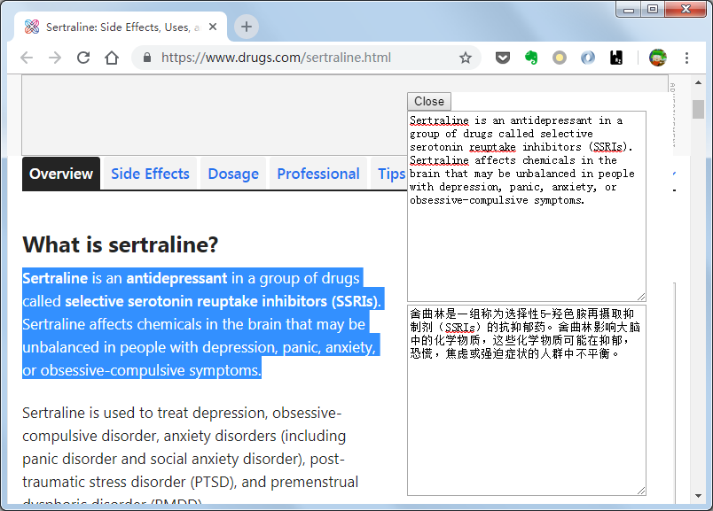

# Translation Popup
适用于Google Chrome浏览器的Google翻译扩展程序

# Installation
1. git clone https://github.com/ssynhtn/translation-popup-extension.git
1. 打开 chrome://extensions
2. 打开开发者模式
3. 加载已解压的扩展程序
4. 选择项目目录
5. 刷新任意页面后即可使用

# Usage
在页面选中文字后, 在右键菜单中选择"翻译"选项即可

# Preview
